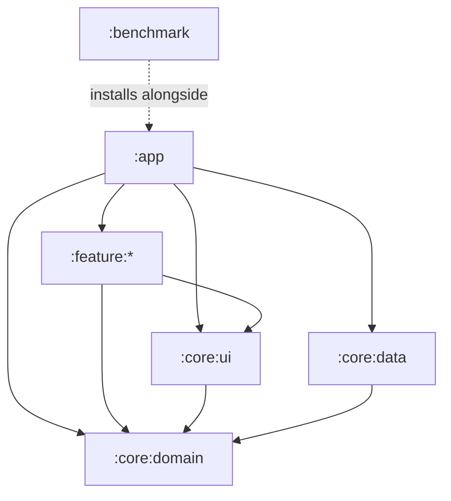

# Architecture

<AppName /> is split into layers and vertical slices, and the boundaries between them are
checked by the build rather than by memory. The full reference is
<RepoLink path="docs/ARCHITECTURE.md" />.

## Modules

```text
titan/
├── build-logic/     convention plugins (titan.android.*)
├── app/             composition root: Application, the single Activity, the NavHost, Hilt wiring
├── benchmark/       Macrobenchmarks and the Baseline Profile generator
├── core/
│   ├── domain/      business logic: pure Kotlin JVM, no Android dependencies
│   ├── data/        Room, DataStore, repositories, notifications, backup
│   ├── ui/          design system and shared Compose components
│   └── testing/     screenshot and accessibility test support (test classpath only)
└── feature/
    ├── onboarding/  the first-run flow
    ├── home/        the Home tab
    ├── session/     new session → active session → summary
    ├── history/     the Sessions and Library tabs, templates, plate calculator
    ├── progression/ the Stats tab: records, charts, body, quests
    └── settings/    settings, backup, reminders, licences
```

## Who may depend on whom



- **`:core:domain` depends on nothing.** It is a plain Kotlin library, so every business rule
  (PR detection, the next-load engine, XP, streaks, the backup format) is tested on the JVM in
  milliseconds. It carries a 95% line-coverage floor.
- **Features never depend on each other.** Each exposes a `NavGraphBuilder` extension and
  reports what happened through lambdas (`onSessionFinished`); `:app` alone decides where that
  leads.
- **`:core:ui` renders domain types but never calls a use case.** Shared components such as
  the set row, the rest timer or the body diagram are stateless and hoisted.

`./gradlew checkArchitecture` asserts the declared dependencies of every module against these
rules, and runs as part of `check` and in CI. A module with no rule fails the check, so a new
module has to be placed deliberately.

## Screens

Every screen is a pair: a stateful `XRoute` that collects the ViewModel's state, and a
stateless `XScreen(state, onEvent)` that only draws it. The stateless half is what previews,
screenshot tests and accessibility checks render.

Routes are `@Serializable` destination types, so a wrong argument is a compile error. The shell
is a four-tab scaffold (Home, Sessions, Library, Stats), each tab a nested graph with its own
back stack. A workout, onboarding and settings are modes outside it, shown full-screen without
the tab bar, so a stray tap can never lose a set in progress.

Every screen keeps its own state across process death through `SavedStateHandle`, and the
workout in progress is rebuilt from the database, so killing the app mid-set loses at most the
field being typed.

## Design system

`:core:ui` holds one Material 3 colour scheme per mode, a type scale with mono numerals for
figures, spacing and shape tokens, and the shared components. A screen needs no raw colour and
no magic spacing. Dynamic colour is deliberately off: the single red accent is the app's only
signal, and it should be the same red on every phone. Both schemes are held to WCAG AA by a
test that fails the build.

## Testing

| Kind | Where |
| --- | --- |
| Domain unit tests | `:core:domain`, JVM, with a coverage floor |
| DAO, migration and backup tests | `:core:data`, Robolectric over a real SQLite |
| Screen tests | each feature, Compose UI tests on Robolectric |
| Screenshot tests | every `@Preview` becomes a Roborazzi reference image, light, dark and twice the font, and is scanned by the Accessibility Test Framework |
| End-to-end journeys | `:app`, four user journeys through the assembled graph |
| Performance | `:benchmark`, startup and scrolling on a real device |

`make test` runs the unit tests and compares the screenshots. See
[Contributing](contributing#run-the-checks).
