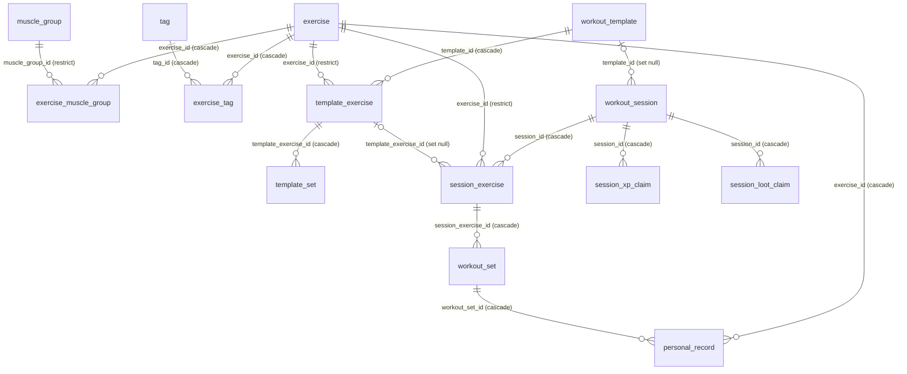

# Data model

Everything <AppName /> knows lives in one SQLite database, `titan.db`, accessed through
Room in `:core:data`, plus a small Preferences DataStore for settings. There is no server
side: this schema is the whole system of record.

The canonical, much longer reference is <RepoLink path="docs/PERSISTENCE.md" />. This page is
the map.

## The schema

The diagram is generated from the schema Room exports
(<RepoLink path="core/data/schemas/com.titan.core.data.db.TitanDatabase/1.json" />) by
`scripts/schema-to-mermaid.py` in this site's repository, so it matches what ships. Edges are
labelled with the foreign key and what happens to the child row when its parent is deleted.
Tables with no foreign key (`body_measurement`, `user_progress`, `achievement`,
`quest_completion`, `collected_item`) stand alone and are left out; the columns of every table
are in the schema file.

It falls into four groups:

| Group | Tables | Holds |
| --- | --- | --- |
| **Catalogue** | `exercise`, `muscle_group`, `exercise_muscle_group`, `tag`, `exercise_tag` | The 873 seeded exercises and the user's own, with the muscles they work. |
| **Plans** | `workout_template`, `template_exercise`, `template_set` | Templates: which exercises, in which order, with which sets. |
| **History** | `workout_session`, `session_exercise`, `workout_set`, `personal_record`, `body_measurement` | Everything logged. `personal_record` is derived from `workout_set` and cascades with it. |
| **Progression** | `user_progress`, `achievement`, `quest_completion`, `collected_item`, `session_xp_claim`, `session_loot_claim` | XP, level, streak, unlocks and loot. The two claim tables make the post-session rewards idempotent. |

## Storage conventions

Every physical quantity is an **integer in a fixed unit**. There is no floating point in the
schema, so values round-trip through the JSON export exactly, and the unit a user picked is
purely a display choice.

| Concept | Stored as |
| --- | --- |
| Weight | milligrams |
| Distance | centimetres |
| Body circumference | millimetres |
| Body fat | percent × 10 |
| RPE | RPE × 10 |
| Durations and rest | seconds |
| Timestamps | epoch milliseconds, UTC |
| Booleans | `0` / `1` |

A few rules the schema relies on but cannot express itself:

- **Single user.** There is no `user_id` anywhere. `user_progress` has exactly one row, enforced
  by `CHECK (id = 1)`.
- **Enum-like text columns** (`equipment_type`, `set_type`, `pr_type`, …) hold uppercase
  domain identifiers. Room cannot add `CHECK` constraints, so anything writing directly (an
  importer, a restore) validates them itself.
- **No soft deletes.** Deleting an exercise that has history is refused (`RESTRICT`); deleting
  a session cascades to everything derived from it.
- **Derived values have no column.** A template's estimated duration and a measurement's lean
  mass are computed on read, so they can never be stale.

## Seed data

The exercise catalogue is generated, not hand-written: `tools/seed/generate_seed.py` (`make
seed`) turns the public-domain [free-exercise-db](https://github.com/yuhonas/free-exercise-db),
pinned by commit, into `core/data/src/main/assets/seed/exercises.sql` and one image per
exercise. Every statement is `INSERT OR IGNORE`, so replaying the seed over a populated database
changes nothing. CI runs `make seed-check` to fail on stale assets.

## Migrations

The database is deliberately **not** built with `fallbackToDestructiveMigration`. On a phone
that holds the only copy of someone's training history, a schema version with no migration
path should crash at startup rather than silently wipe years of data.

A schema change therefore always comes with:

1. the entity change and a `version` bump in `TitanDatabase`;
2. a `Migration` added to `TitanDatabase.MIGRATIONS`;
3. the new schema JSON that KSP exports, committed next to the old ones, which are never edited;
4. a `MigrationFixture` in `DatabaseMigrationTest` that seeds rows at the old version and
   asserts they survive the upgrade.

## What is not in the database

| What | Where | Why |
| --- | --- | --- |
| Settings | Preferences DataStore, `user-preferences` | Small key-value data read on every screen. |
| An in-progress workout's draft | `files/in-progress-session.json` | UI state that survives process death; the sets themselves are real rows from the moment they are logged. |
| A half-built template | `files/template-draft.json` | The editor's unsaved work. |
| Automatic backups | `backups/` in the app's external files directory | Export files, three kept. |

All of it is excluded from Android's cloud backup and device transfer, so a user's data leaves
the phone only in an [export](export-format) they asked for.
